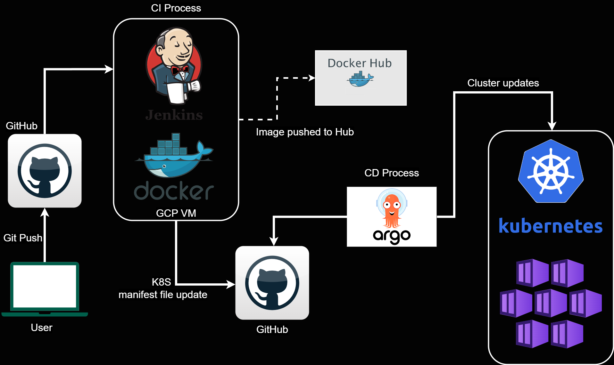

# Setting Up a Complete CI/CD Pipeline with Jenkins, Argo CD, Docker, and Kubernetes
#

### Overview

In this project, I demonstrate how to set up a complete Continuous Integration and Continuous Deployment (CI/CD) pipeline using Jenkins for continuous integration and Argo CD for continuous delivery. This pipeline is designed to efficiently automate the deployment process of a simple JavaScript-based application, leveraging Docker for containerization and Kubernetes for orchestration.

### Project Details

**Objective:**
To create a robust CI/CD pipeline using Jenkins and Argo CD, demonstrating an end-to-end deployment process with a simple JavaScript application.

**Tools Used:**
- **Machine:** Ubuntu based VM in Google Cloud Platform (e2-medium, Arch: x86/64)
- **Jenkins:** For Continuous Integration
- **Argo CD:** For Continuous Delivery
- **Docker:** For creating container images
- **Kubeadm:** For creating Kubernetes cluster
- **GitHub:** For version control and repository management

### Features

1. **Automated Jenkins Pipeline:**
   - Uses declarative Groovy scripting.
   - Triggers on code push to the GitHub repository.
   - Builds Docker images and pushes them to Docker Hub.
   - Updates Kubernetes deployment manifests with new Docker images.

2. **Argo CD for Continuous Delivery:**
   - Monitors the repository with deployment manifests.
   - Automatically synchronizes application state with the Kubernetes cluster.
   - Handles application updates, scaling, and other Kubernetes resource management tasks.

3. **End-to-End Deployment:**
   - Automated build and deployment process triggered by code changes.
   - Real-time deployment to a Kubernetes cluster using Docker images.
   - Ensures seamless and continuous delivery of application updates.

### Workflow

1. **Initial Setup:**
   - Set up a  simple JavaScript application repository in GitHub with all the required package details.
   - Write a Jenkinsfile and DOckerfile in the root of the repository to define the CI pipeline.
   - Configure Jenkins to pull the latest changes from the GitHub repository.

2. **CI Process:**
   - Jenkins checks out the code from GitHub.
   - Builds a Docker image for the JavaScript application based on Dockerfile.
   - Pushes the Docker image to Docker Hub.
   - Updates the Kubernetes deployment manifest in a separate repository with the new image tag.

3. **CD Process:**
   - Argo CD monitors the repository with the deployment manifests.
   - Automatically synchronizes the application state with the Kubernetes cluster.
   - Updates the Kubernetes resources such as creating new containers, increasing replicas, etc., with the updated Docker image.

### Demo

- Demonstrated live changes to the application.
- Showed how Jenkins builds and pushes the Docker image.
- Showed how Argo CD automatically deploys the updated application to the Kubernetes cluster.
- Verified the deployment by accessing the updated JavaScript application in the browser.

### Conclusion

This project highlights the ease and efficiency of setting up a CI/CD pipeline using Jenkins and Argo CD. It showcases the benefits of a declarative approach, the power of CI/CD, and the seamless integration between Jenkins, Docker, and Kubernetes. This project provides a clear and practical example of modern CI/CD practices.

**GitHub Repositories:** 
[CI-CD_with_ArgoCD](https://github.com/Praj0496/CI-CD_with_ArgoCD.git)

[Argo_project_K8S_manifest](https://github.com/Praj0496/Argo_project_K8S_manifest.git)

Demo video: https://drive.google.com/file/d/1gq-toG7rA5IHTU2nJrLPSY2gD7DzNkTw/view?usp=sharing

**Resources:**

Jenkins Install: https://pkg.jenkins.io/debian-stable/ 

Docker Install: https://docs.docker.com/engine/install/ubuntu/#install-using-the-repository

Kubeadm Install: https://kubernetes.io/docs/setup/production-environment/tools/kubeadm/install-kubeadm/

Argo CD setup: https://argo-cd.readthedocs.io/en/stable/getting_started/

DockerHub: https://hub.docker.com/

Grant Jenkins user and Ubuntu user permission to docker deamon.
sudo su - 
usermod -aG docker jenkins
usermod -aG docker ubuntu
systemctl restart docker

Prajwal
